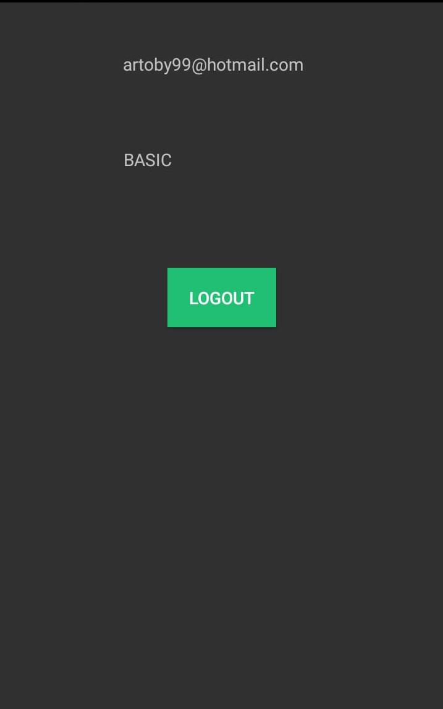

# Proyecto 1 de Android 📱

### Integrantes

- Alvarez Loran Juan Pablo 
- Barreiro Valdez  Alejandro  
- Chilpa Navarro Martín Enrique  
- Espinosa Guadarrama Arturo  
- Flores Salinas Ana Paula  
- Lagunas Parra Ana Paola  
- Zarco Muñoz Gabriel

___

# Objetivo de la app

  El principal objetivo de esta aplicación es poder aplicar cada uno de los conocimientos adquiridos en el curso de Android, empleando 
  para ello el lenguaje de programación Kotlin al igual que los servicios online de base de datos y funciones analíticas de Firebase. 

___

# Finalidad de la app

  Esta aplicación tendrá como finalidad servir como un servicio de mensajería en el cual se pueda enviar y recibir correos electrónicos 
  de una cuenta registrada, al igual de contener un menú interactivo para poder navegar entre el servicio de mensajeria, un calendario 
  y una sección de minijuegos (al principio contará solamente con el juego del gato).

___

# Secciones que contiene la app

  La aplicación contendrá diversas secciones las cuales servirán como una guía para que el usuario pueda interactuar con dicha 
  aplicación, no necesariamente se deberán cumplir las secciones de manera líneal, si no que tiene el propósito de servir como guía 
  para que el usuario conozca todas las funcionalidades de dicha aplicación.

## App lista para probarse

  Cuando la app se encuentre instalada en el dispositivo, en el aparecerá un icono con el logo principal de la aplicación, lo cual 
  indica que la app se encuentra lista para ser ejecutada.

## Splash Screen

  Mientras la app este inicializando y cargando su contenido, se mostrará momentaneamente un imagen con el logo principal de la app, 
  conocida como 'Splash Screen', la cual solo se mostrará un par de segundos cuando la app apenas sea abierta.

## Ventana de login

  Una vez cargada la app en primer plano en el dispositivo móvil, se mostrará una ventana la cual contendrá dos vistas de texto para 
  que el usuario pueda ingresar sus datos para poder iniciar sesión, además de contar con dos botones, los cuales serán utilizados 
  para confirmar el inicio de sesión o registrar a un nuevo usuario en caso de no existir (todos los usuarios creados serán
  almacenados en una base de datos empleando la plataforma Firebase, más adelante se explica sus usos).

 

  Tambien es posible registrarse o iniciar sesión con los tres botones que aparen debajo de estos últimos, los cuales se 
  redireccionaran a la red social dependiendo del botón escogido (siendo Facebook, Google y Twitter las opciones), obteniendo la 
  información del usuario con la ayuda de Firebase.

## Ventana emergente 1: Error de autenticación

  Cuando el usuario a ingresa sus datos dentro la app (Correo y contraseña), si el usuario oprime el botón de 'login' y este no está 
  registrado, entonces se mostrará una ventana emergente la cual envía un mensaje de error de autenticación, por lo cual el usuario 
  no podrá acceder a las funcionalidades de la app.

## Ventana de acceso

  Momentánemante, cuando se haya autentificado a un usuario registrado y este haya accedido a la app, entonces se mostrará una ventana 
  la cual contedrá unicamente dos textview en donde se muestre tanto el correo del usuario registrado como tambien la forma de 
  autenticación realizada para ingresar a la app (Esto dependerá del servicio con el que se ingrese, y en este caso cuenta con 4 formas 
  de acceso: Facebook, Twitter, Google y la tradicional o conocida como BASIC, donde solamente ingresa su correo electrónico y su 
  contraseña).

  Además de ello, se cuenta con un botón logout el cual permite al usuario cerrar la sesión con la que ingreso a la app.

## Ventana para redactar un correo  

  Esta ventana le permite al usuario redactar un correo ya que esté autentificado. Contiene dos botones en la parte superior de la pantalla, uno es para volver a la ventana anterior y otro para enviar el correo. También hay tres partes donde el usuario puede ingresar texto. La primera es para escribir el destinatario, la segunda para escribir el asunto del correo y la tercera para escribir el correo. Esta ventana tomó las funcionalidades de la app de Gmail pero es más minimalista.

## Ventana con las bandejas de correo  

  Se puede acceder a las distintas bandejas que ofrece un servicio de mail. En la parte superior tiene un botón para volver a la ventana anterior. En la parte superior de la ventana, en el centro, hay una imagen donde va la foto de perfil del usuario. Debajo de la imagen se listan con botones las bandejas que pueden ser accesadas dentro de la aplicación. Las bandejas son de principal, destacados, enviados, borradores y spam. Se cuentan con las bandejas más esenciales y usadas del correo electrónico.

